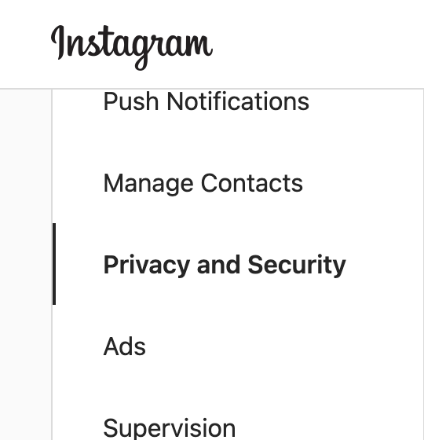
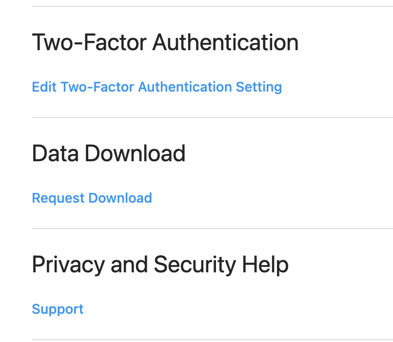
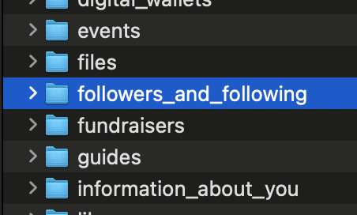
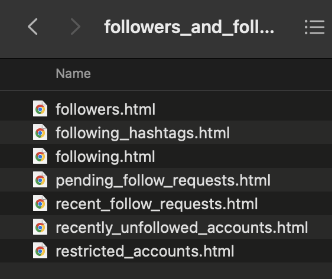
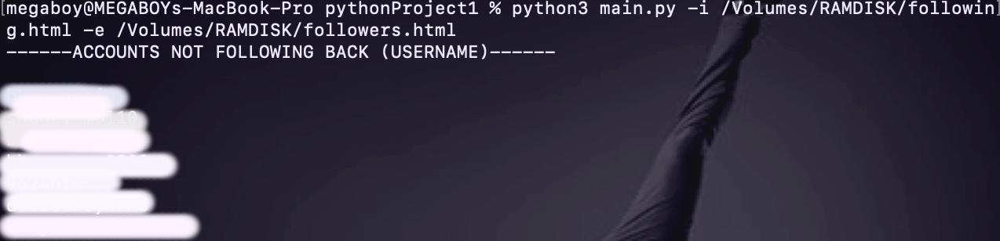

# InstaFollowBack
Checking Accounts that are not following back on Instagram with account dumped file HTML

It use local HTML file dumped from Instagram "Request Download" instead of direct loggin the account to avoid getting banned.

# To use this script a local copy of Instagram account data is required.

1) Log in your Instagram account with browser
2) Go to Settings > Privacy and Security > Data Download > Request Download




3) Unzip the dumped File and navigate to followers_and_following.
```
followers.html
following.html
```

This script compares the difference between followers.html and following.html for checking accounts that are not following back.




# Example
```
instafollowback.py -i /path/to/following.html -e /path/to/followers.html
```
The script will print the account names that are not following back.

# Output


# Help

```
usage: instafollowback.py [-h] [-i FOLLOWING_FILE] [-e FOLLOWER_FILE]
optional arguments:
  -h, --help            show this help message and exit
  -i FOLLOWING_FILE, --following FOLLOWING_FILE
                        Following List Html Dump
  -e FOLLOWER_FILE, --follower FOLLOWER_FILE
                        Followers List Html Dump
```
# Front-end
Front-end webpage of this project is available at <a href="https://github.com/bboymega/InstaFollowingBack-Web">InstaFollowingBack-Web</a>
